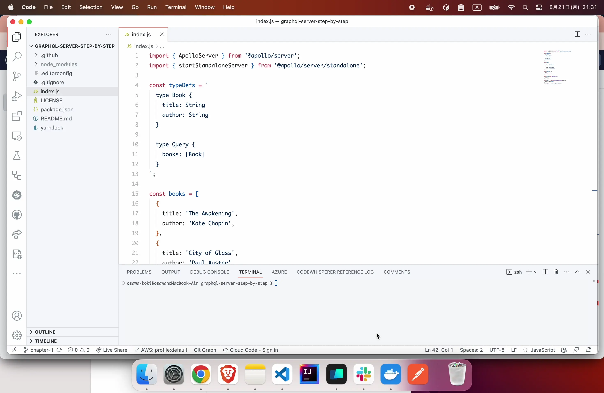

# graphql-server-step-by-step

🥜🥜🥜 GraphQLサーバの構築を、ステップバイステップで進めていく！  

## 説明

各タグごとに一つのステップとなっており、それぞれのステップで実装する内容が異なります。  
各タグの内容は、以下の通りです。  

- step-1: 最も簡単なGraphQLサーバの構築。
- step-2: GraphQLサーバをTypeScriptに変換してみよう。
- step-3: GraphQLスキーマを外部ファイル化する！
- step-4: GraphQLのスキーマ定義からTypeScriptの型定義を自動生成しよう！

## Step1 - 最も簡単なGraphQLサーバの構築

ここでは、JavaScriptで最も簡単なGraphQLサーバを構築します。  

  

## Step2 - GraphQLサーバをTypeScriptに変換してみよう

ここでは、JavaScriptで構築したGraphQLサーバをTypeScriptに変換してみます。  
GraphQLはサーバとクライアントのスキーマ(型定義)を簡単に同期できるので、TypeScriptの強みを活かして開発を進めていきます。  

## Step3 - GraphQLスキーマを外部ファイル化する

ここでは、GraphQLスキーマを外部ファイル化してみます。  
GraphQLのスキーマ定義は特定のディレクトリ内にまとめて、管理しましょう！  

## Step4 - GraphQLのスキーマ定義からTypeScriptの型定義を自動生成しよう

ここでは、GraphQLのスキーマ定義からTypeScriptの型定義を自動生成してみます。  
GraphQLで定義されたスキーマをベースに、TypeScriptの型定義を自動生成することで、型定義の手間を省くことができます。  
また、型定義のミスを防ぐことができるので、安心して開発を進めることができます。  
